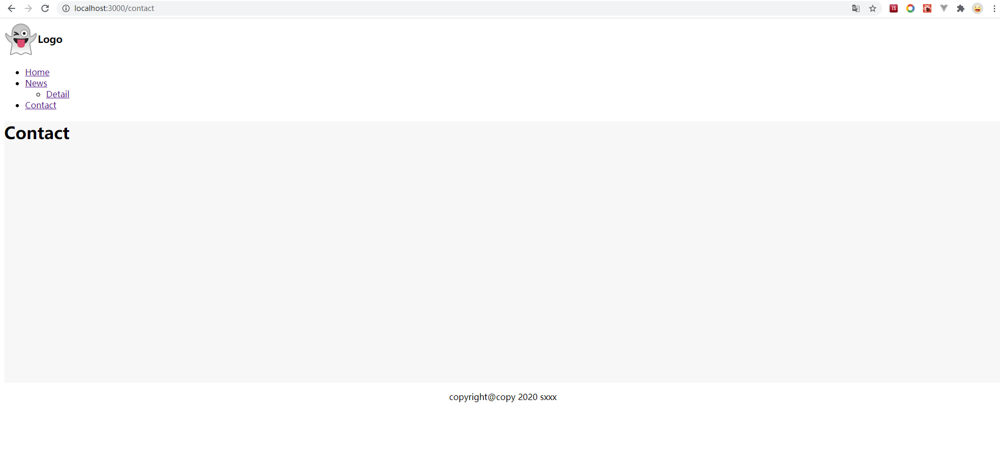

React Router Template
## React Router Template
create-react-app, react-router-dom, layout


```
- yarn install

- yarn run start

- yarn run build
```


### Router Config
```
// /src/router/index.js

export const routes = [
    {
        path: '/',
        title: 'Home',
        name: '/',      // must be uniqueue
        component: lazy(()=>import('../pages/Home')),

    },
    {
        path: '/news',
        name: 'news',
        title: 'News',
        component: lazy(()=>import('../pages/News/News')),
        children: [

            {
                name: 'news_detail',
                title: 'Detail',
                path: '/detail',
                component: lazy(()=>import('../pages/News/Detail')),
            }
        ]
    },{
        path: '/contact',
        name: '/contact',
        title: 'Contact',
        component: lazy(()=>import('../pages/Contact'))
    }
]
```
### Layout
```
├─assets
│  └─img
├─layout
│  └─footer.jsx
│  └─header.jsx
│  └─index.jsx
│  └─menu.jsx
├─pages
│  └─News
└─router
```
